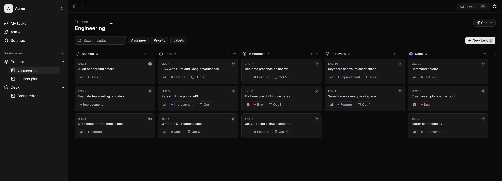

# TrackaAI

**Project management with AI teammates built in.** TrackaAI is a fast, Linear-style issue tracker. On top of the Kanban boards, AI does real work: it writes issues from a sentence, breaks big ones down, answers questions about your board, and acts as a teammate you can assign issues to.



## Features

**Planning**
- **Teams → workspaces → boards → issues**, with keys like `ENG-12`, priorities, labels, assignees, due dates, sub-tasks and Markdown descriptions and comments.
- **Kanban boards:** drag and drop, or use the keyboard (Space picks a card up, arrows move it), realtime updates across everyone on the board, filters, and a command palette (`⌘K`).
- **Teams:** owner, admin and member roles; invite links; ownership transfer.

**AI** (Claude, through the Vercel AI SDK)
| Feature | What it does | Plans | Model |
|---|---|---|---|
| **Write with AI** | Turns one line into an issue: title, description, acceptance criteria, priority and labels | All | `claude-haiku-4-5` |
| **Break down with AI** | Splits an issue into sub-tasks you pick from | All | `claude-haiku-4-5` |
| **Ask AI** | Chat with every issue in the team ("what's urgent?", "who has what?"); read-only, links to each issue | All | `claude-sonnet-5-5` |
| **Board copilot** | Ask about a board or tell it what to change; every change is a card you approve first | Pro | `claude-sonnet-5` |
| **AI teammates** | Assign an issue to an AI teammate; it posts a spec, plan or draft as a comment and moves the issue to review | Pro | `claude-sonnet-5` |

Every AI request counts as one **AI run**: Free includes 10 a month, Lite 100, and Pro is unlimited. Each person can make at most 20 a minute. AI only acts with the permissions of the person using it.

**Plans:** Free (just you, 1 workspace), Lite ($10/month: 3 people, 10 workspaces), Pro ($25/month: unlimited, every AI feature). Billing is **simulated**: checkout changes the plan, and no card is charged.

**Marketing site:** a dark landing page at `/` and a pricing page at `/pricing`.

## Tech stack

- **Next.js 16** (App Router, React 19, server actions, `proxy.ts`), TypeScript (strict), **pnpm**, Node 22
- **Supabase**: Postgres, Auth, Realtime, and row-level security on every table
- **Tailwind CSS v4** + **shadcn/ui**, Lucide icons, dark mode by default
- **Vercel AI SDK** with `@ai-sdk/anthropic`
- dnd-kit with fractional indexing for board ordering, and Zod for validation
- **Vitest** (unit, plus database tests in PGlite) and **Playwright** (end-to-end, accessibility with axe, visual snapshots)

## How it fits together

```
Browser ──► Next.js (server components + server actions + /api/ai/* routes)
              │  validates input (Zod), checks permissions and plan limits
              ▼
          repositories (src/server/data) ──► Supabase Postgres (RLS)
                                         └─► or a local JSON file (mock backend)
```

- **The UI never talks to the database directly.** Everything goes through the repository interfaces in `src/server/data/types.ts`. There are two backends: `mock` (a JSON file, used for local development and the test suite) and `supabase`.
- **Security in depth:**
  - The server checks permissions and plan limits.
  - The database enforces the same rules again with RLS policies and functions.
  - AI tools run with the caller's permissions.
  - Only the server can post as an AI teammate, using a worker token.
  - See [docs/database.md](docs/database.md) for every table, who can do what, and the database functions.

## Getting started

You need Node 22 and pnpm.

```bash
git clone https://github.com/faceless121212/TrackaAI.git
cd TrackaAI
pnpm install
cp .env.example .env.local
pnpm dev
```

Open http://localhost:3000. By default the app runs on the **mock backend**, a local JSON file. Sign in as `demo@trackaai.test` / `demo-password`. Delete the `.data/` folder to reset.

To turn on AI, put an Anthropic API key in `.env.local` (`ANTHROPIC_API_KEY=sk-ant-api03-…`, from [console.anthropic.com](https://console.anthropic.com/settings/keys)). To use Supabase instead of the JSON file, see [Supabase](#supabase) below.

## Environment variables

All of them go in `.env.local` locally, and in the Vercel project settings in production. `.env.example` lists them with explanations.

| Variable | Needed for | Notes |
|---|---|---|
| `DATA_BACKEND` | always | `mock` (default) or `supabase` |
| `NEXT_PUBLIC_SUPABASE_URL` | Supabase | Public value (Project Settings → API) |
| `NEXT_PUBLIC_SUPABASE_PUBLISHABLE_KEY` | Supabase | Public value. The secret key is never needed |
| `APP_URL` | production | The site's public address, e.g. `https://trackaai.vercel.app`. Used in confirmation and invite links. If it's missing on Vercel, the deployment's own address is used (handy for preview deployments) |
| `ANTHROPIC_API_KEY` | AI | **Secret.** Without it, the AI features are hidden |
| `TOOL_APPROVAL_SECRET` | Copilot in production | **Secret**, any random string of 32+ characters. Without it the copilot is hidden in production |
| `AGENT_WORKER_SECRET` | AI teammates (Supabase) | **Secret**, 32+ characters. The database stores its SHA-256 in `private.worker_secrets` |
| `SESSION_SECRET`, `MOCK_DB_PATH` | mock backend | Local development only. The app refuses the mock backend on Vercel |
| `AI_MOCK`, `DEBUG_SUPABASE` | development | Mock AI model / log every Supabase request |

Never put a secret in a variable starting with `NEXT_PUBLIC_`: those are sent to the browser.

## Supabase

1. Create a Supabase project, then apply `supabase/migrations/*.sql` in order (the Supabase CLI or the SQL editor).
2. Set `DATA_BACKEND=supabase` and the two public values above.
3. For local development only, run `supabase/seed.sql`. It creates the confirmed accounts `demo@trackaai.test` and `mate@trackaai.test` (password `demo-password`) and a demo team. **Never seed a public site:** that password is public.
4. In the dashboard (Authentication), keep **Confirm email** on and turn on **Leaked password protection**. Connect an **SMTP** provider so confirmation emails reach everyone; Supabase's built-in mailer only sends to your project team's addresses.
5. For AI teammates, set `AGENT_WORKER_SECRET` and store its SHA-256 in the database. Get the hash with `printf %s "$AGENT_WORKER_SECRET" | shasum -a 256` (`printf`, not `echo`: a trailing newline changes the hash). Then run the `insert … on conflict` from the header of `supabase/migrations/20261001100000_agent_worker_token.sql` in the SQL editor.

## Deploying to Vercel

Vercel builds the app straight from GitHub and redeploys on every push to `main`.

1. **Import the repo:** at [vercel.com/new](https://vercel.com/new), choose **Import Git Repository**, pick `faceless121212/TrackaAI`, and keep the detected settings (framework Next.js, pnpm, Node 22). Leave **Fluid compute** on (the default): the board page can take up to 120 s to stream, which the Hobby plan only allows with Fluid compute.
2. **Add the environment variables** (Settings → Environment Variables). Tick **Production** and **Preview** for all of them except `APP_URL`, which is Production only; previews use their own address automatically. Without `DATA_BACKEND=supabase` a deployment refuses to start, since the local JSON backend can't run on Vercel.
   - `DATA_BACKEND` = `supabase`
   - `NEXT_PUBLIC_SUPABASE_URL` and `NEXT_PUBLIC_SUPABASE_PUBLISHABLE_KEY`: the same values as in `.env.local`
   - `APP_URL` = your Vercel address, e.g. `https://trackaai.vercel.app` (no trailing slash)
   - `ANTHROPIC_API_KEY`, `TOOL_APPROVAL_SECRET`, `AGENT_WORKER_SECRET`: copy them from `.env.local`. `AGENT_WORKER_SECRET` must be the same value whose hash is in the database
3. **Deploy.** The first build takes a couple of minutes.
4. **Tell Supabase about the new address** (Authentication → URL Configuration):
   - set **Site URL** to the Vercel address;
   - add `https://<your-domain>/auth/callback**` to **Redirect URLs** (the `**` keeps the `?next=` part, e.g. for invite links), so email confirmation links come back to the live site. For previews, also add `https://*-<your-vercel-team>.vercel.app/auth/callback**`.
5. **Before sharing the link,** remove the development seed accounts (`demo@` / `mate@trackaai.test`) and their `acme` team, or at least change their password. Anyone who reads this README could otherwise sign in.

After that, each merged pull request deploys automatically. Pull requests also get their own preview URLs.

## Scripts

| Command | Does |
|---|---|
| `pnpm dev` | Development server on :3000 |
| `pnpm build` / `pnpm start` | Production build / serve it |
| `pnpm lint` · `pnpm typecheck` · `pnpm test` | ESLint · TypeScript · unit and database tests (Vitest, PGlite) |
| `pnpm test:e2e` | End-to-end and accessibility tests (Playwright, mock backend, mock AI) |
| `pnpm test:supabase` | Repository tests against the live Supabase project |
| `SMOKE_URL=… pnpm test:smoke` | One pass over every feature, real AI included, against a running server |
| `pnpm screenshot` | Retakes the landing page's product screenshot |
| `pnpm test:visual` | Pixel snapshots of the marketing pages (local only) |

CI (GitHub Actions) runs lint, typecheck, unit and e2e tests on every pull request; merging needs it green.

## Project structure

```
src/
  app/            routes: marketing (/ and /pricing), auth, [team] app, /api/ai/*
  components/     UI by area (board, tasks, ask, marketing, settings, ui = shadcn)
  lib/domain/     plans, schemas, ordering, task keys: pure logic shared by client and server
  server/
    actions/      server actions (mutations)
    ai/           models, prompts, copilot / Ask AI tools, AI teammate worker
    auth/         session, guards, permissions
    data/         repository interfaces, mock and Supabase backends
supabase/         migrations (schema, RLS, functions) and the dev seed
e2e/, e2e-live/, e2e-visual/   Playwright suites
docs/             product spec, roadmap, build log, database reference
```

## Documentation

- [docs/prd.md](docs/prd.md): product spec
- [docs/plan.md](docs/plan.md): milestones (M0–M11)
- [docs/build-plan.md](docs/build-plan.md): build log, with decisions and gotchas per milestone
- [docs/database.md](docs/database.md): tables, permissions and database functions
